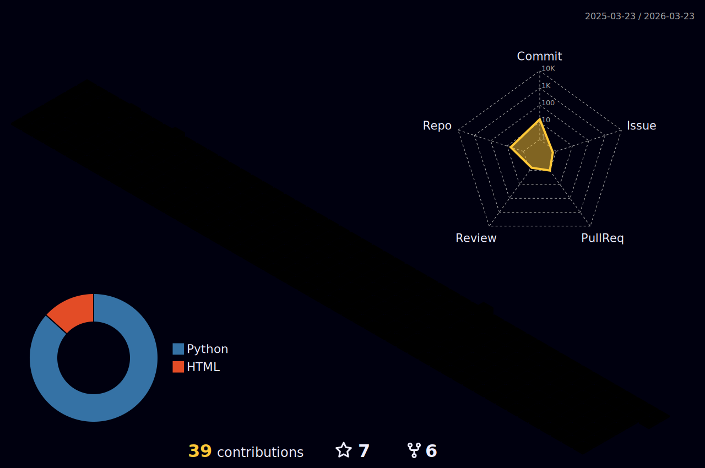

 

 
 
<h1 align="center">Hi, I'm Shodydosh </h1>
 

  

  

 

  
🧮 About

<h2 align="center">🧮 About me</h2>

- Wh0 (˘෴˘) 

- ✨ Hi, I’m Shodydosh

- ✨ Ranking 208,379 on Leetcode

- ✨ 900+ Toeic

- ✨ I’m interested in coding, music and skateboarding

- ✨ I’m currently learning at Posts and Telecommunications Institute of Technology

  
🔭 Tech Stack

<h2 align="center"> Tech Stack</h2>
 

 
  
  
  
  
  
  
  
   
  
  
  
 

  

 
  
💻 GitHub Profile Stats

  

    <h2 align="center"> Github stats </h2>
      
        

           
        

        

          
        

     
  
    

  
📈 Activity Graph

   
  <h2 align="center"> My current activity </h2>

  
⚡ Github Profile Trophy 

   
  <h2 align="center"> Github Profile Trophy </h2>

  

 
<!--  //https://dev.to/envoy_/150-badges-for-github-pnk -->

 
 
 
 \
 
 
 ----
  
 ----
 
 
 
 
 
 
 
 
 
 ----
 
 
 
 
 
  ----
  

  

 
 
⭐️ From Shodydosh
